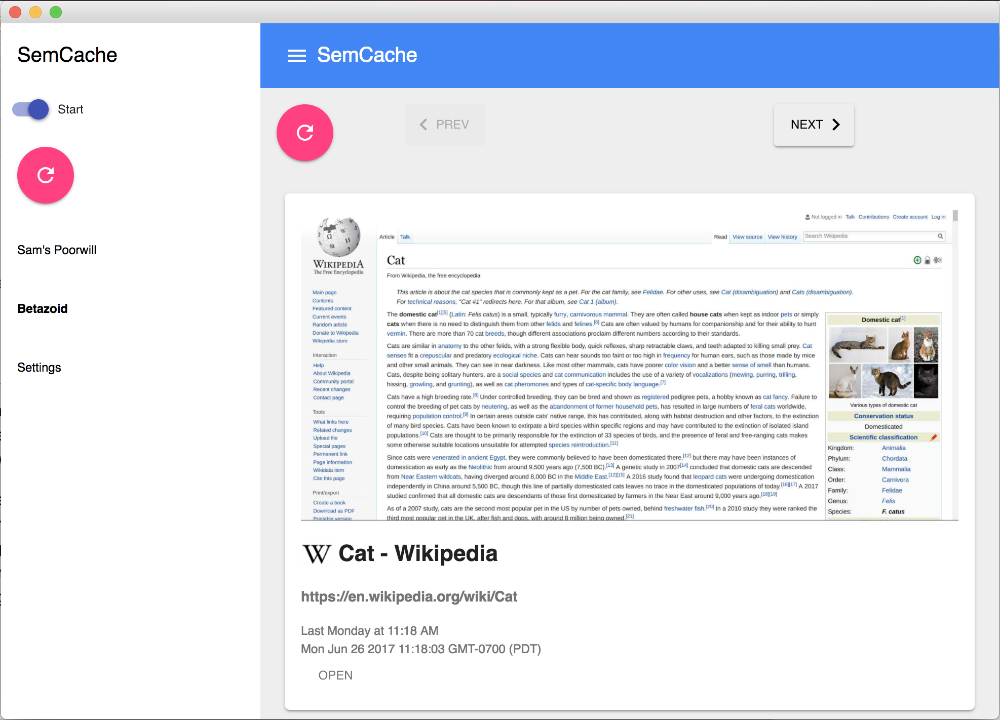
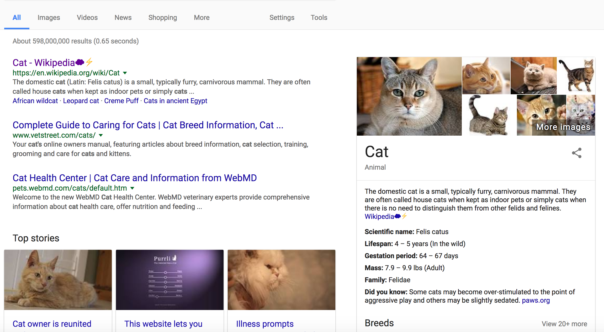
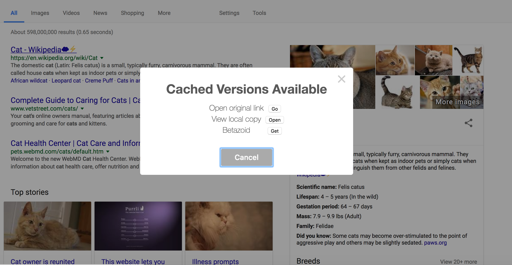

# SemCache

> Save pages offline and share them on a local network.

## Overview

SemCache allows you to save webpages offline and share them on a local network.
When you are connected to the internet, use SemCache to download pages that you
want to access offline. When you do not have an internet connection, you will
be able to visit the saved (or 'cached') versions of these pages. What's more,
other SemCache users on the same network can browse the pages you have cached.

It can be thought of as similar to [Pocket](https://getpocket.com/) but with
local network sharing. It saves webpages as bare `.mhtml`, and does not try to
make them pretty like Pocket.

SemCache is the code for the research project
[Siskin](https://dl.acm.org/citation.cfm?id=3209820).

## Why?

The purpose of SemCache is to leverage the networks that often exist between
devices even if the external connection to the internet is down or is
unreliable. Maybe a teacher travels to a city on the weekend, caches a bunch of
educational webpages, and wants to share the content with their students during
the week after they return to the village. Maybe someone visits a remote
village and has the latest sports scores saved on their computer. Maybe someone
caches a large percentage of Wikipedia on a dedicated machine in their village.
Or maybe you're just on a crummy connection at an airport and are desperate for
something to read.

SemCache makes this easy.

## How?

To accomplish this, SemCache comprises both a Chrome App and a Chrome
Extension. Clicking the extension icon allows a page to be saved offline. The
App UI presents saved pages to the user and allows you to browse peer content
on the same LAN.

The screenshot below shows the App UI. It has been started (the toggle in the
top left) and shows peers on the LAN in the left panel. `Sam's Poorwill` is the
name of our local machine. `Betazoid` is the name of a peer on the network.
`Betazoid` is currently selected, and the pages that have been cached on their
machine are shown in the main panel. These pages can be browsed and opened
directly by clicking the `OPEN` button.

    

After being started, SemCache also annotates pages to show what content is
available on the local network. This allows users to browse normally, but
prefer local content at their own discretion. Links that are available locally
are annotated with a lightning bolt (⚡) icon. Links that are available on the local network are
annotated with a cloud (☁️) icon.

The screenshot below shows that both ourselves and a peer on the network have
saved the wikipedia cat page. We both show exceptional good taste.

    

Clicking on a link that is locally available will show a popup. We can open the
original link, hitting the web, open our local copy, or fetch a cached copy
from a peer over the LAN and open that copy.

    

## Installation

The easiest thing to do is install `app.crx` and `extension.crx`, which are
both in the `bin/` directory.

Alternatively, both the App and Extension exist built in the repo and can be
loaded via [chrome://extensions](chrome://extensions) by selecting the `dist/`
directories.

After opening the app, select the settings on the left side of the panel and
the fields there, which are for now still required. After this moderate
configuration, you can start saving and browsing local pages like a boss.
